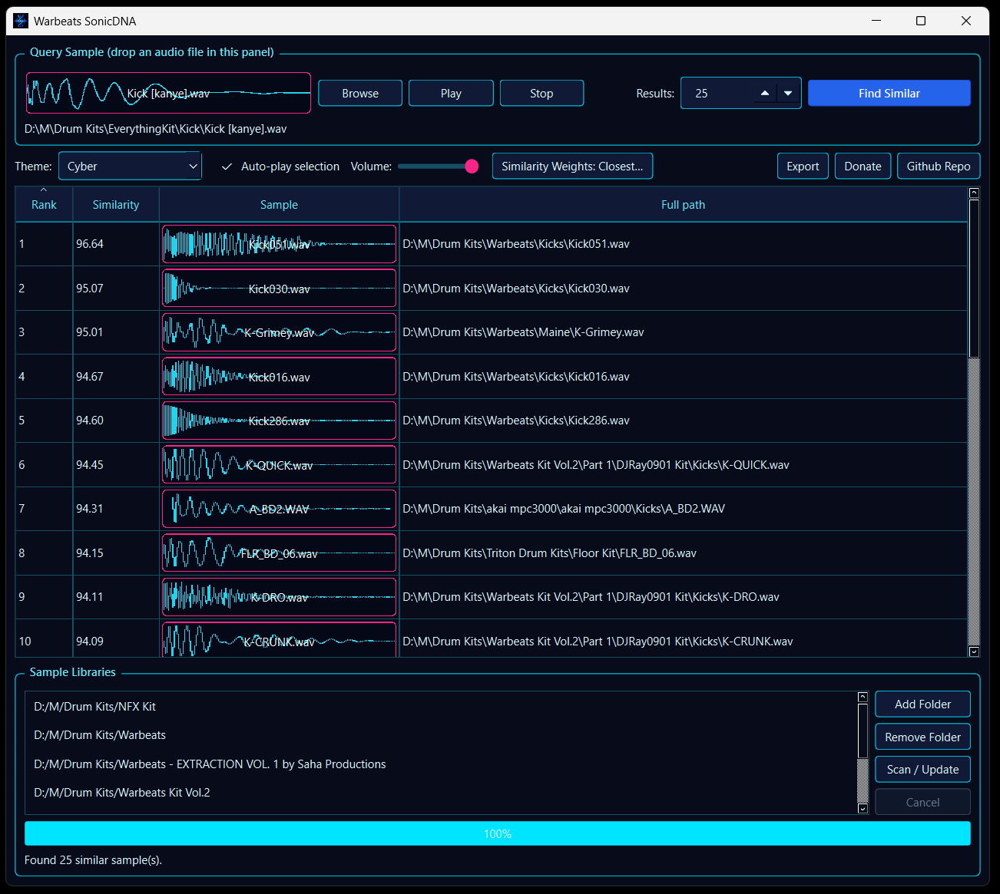

# SonicDNA

SonicDNA is a local-first themeable desktop application for finding acoustically similar audio samples. It
includes a graphical interface, command-line search, and a persistent incremental index.

For an exact description of preprocessing, the 177-value fingerprint, weighting, scoring, and
ranking, see [Audio Processing and Matching](AUDIO_MATCHING.md).

[Demo video and Windows installation walkthrough](https://youtu.be/BTy9fguFcoU)

 

## Installation

### Requirements

- [Python 3.12 or newer](https://www.python.org/downloads/)
- Windows 10/11, a current macOS release, or a modern Linux desktop
- An available audio-output device for sample preview

Download or clone the project, then open a terminal in the SonicDNA directory. The supplied
launcher creates an isolated `.venv` virtual environment and installs SonicDNA and its Python
dependencies automatically on the first run. The initial installation can take several minutes.
The launchers display numbered setup stages, the selected Python version, dependency-check status,
and verbose pip download/build progress during installation. On every later launch, they compare
the current runtime requirements with the installed environment. New or changed requirements from
a project update are installed automatically before SonicDNA starts.

On Windows:

```powershell
.\start.bat
```

When `start.bat` is run without arguments, it launches the desktop application through
`pythonw.exe` and immediately closes its CMD window. A command-line search with arguments remains
attached to the terminal so scan progress, results, and errors stay visible.

To launch the desktop interface with a persistent CMD window for debugging:

```powershell
.\start.bat --debug
```

Debug mode uses console Python, displays standard output and error messages while the GUI runs,
and pauses after the application exits so the final traceback or exit code remains visible.

Equivalent launcher commands are:

```powershell
.\start.ps1 --debug
```

```sh
./start.sh --debug
```

In Windows CMD, include the `.bat` extension: `start.bat --debug`. The bare command `start` is a
built-in Windows command and does not invoke SonicDNA's launcher.

Alternatively, use the PowerShell launcher:

```powershell
.\start.ps1
```

On macOS or Linux:

```sh
chmod +x start.sh
./start.sh
```

Linux systems may require the distribution's PortAudio package for low-latency preview. If the
`sounddevice` backend is unavailable, SonicDNA automatically attempts to use Qt Multimedia.

To install manually instead of using a launcher:

```powershell
python -m venv .venv
.\.venv\Scripts\python -m pip install -e .
.\.venv\Scripts\python -m sonicdna
```

On macOS or Linux, replace `.venv\Scripts\python` with `.venv/bin/python`.

## Run on Windows

Python 3.12 or newer is required. The launcher creates `.venv` and installs dependencies on
its first run:

```powershell
.\start.bat
```

With no arguments, the launcher opens the SonicDNA desktop interface. Add one or more library
folders, choose or drop a query sample, and click **Find Similar**. Scanning and feature extraction
run in a background thread and can be cancelled safely. Completed searches report both the number
of indexed files compared and the elapsed query-and-ranking time.

The original command-line workflow remains available by supplying arguments:

```powershell
.\start.bat "C:\Samples\query.wav" "C:\Samples\Library" --limit 10
```

PowerShell users may instead run:

```powershell
.\start.ps1
```

## Run on macOS or Linux

```sh
chmod +x start.sh
./start.sh
```

Pass a query and library path to either launcher to use CLI mode.

## Command-line arguments

Supplying a query file and library folder to a launcher runs SonicDNA in command-line mode instead
of opening the desktop interface:

```text
sonicdna [--limit COUNT] [--database PATH] [--rebuild] QUERY LIBRARY
```

### Positional arguments

| Argument | Description |
| --- | --- |
| `QUERY` | Path to the audio sample used as the similarity query. |
| `LIBRARY` | Path to the library folder to scan recursively and search. |

### Options

| Option | Description |
| --- | --- |
| `-h`, `--help` | Display command-line help and exit. |
| `--limit COUNT` | Return at most this many ranked matches. The default is `10`. SonicDNA still examines the complete indexed library before returning the top results. |
| `--database PATH` | Use a custom SQLite index instead of the platform-default application-data location. |
| `--rebuild` | Discard cached vectors for the selected library and extract every supported file again. |

`--debug` is a Windows `start.bat` launcher mode rather than a SonicDNA CLI search argument. It
opens the desktop interface with an attached CMD window.

Windows example:

```powershell
.\start.bat "C:\Samples\query.wav" "D:\Drum Kits" --limit 25
```

PowerShell example with a custom index:

```powershell
.\start.ps1 "C:\Samples\query.wav" "D:\Drum Kits" --limit 50 --database "D:\Indexes\sonicdna.db"
```

macOS or Linux example:

```sh
./start.sh /samples/query.wav /samples/library --limit 25
```

Use `--rebuild` only when a complete re-extraction is needed. Normal searches already detect and
process new or modified files while reusing unchanged feature vectors.

## Desktop features

- Add and remove multiple recursively scanned library folders
- Drag one or more folders from the operating-system file manager into the Sample Libraries list
- Incremental background indexing with progress and cancellation
- Browse for or drag-and-drop a query sample using the compact folder button
- Query files are accepted only when dropped inside the Query Sample panel
- A 300-pixel query drop target that overlays the filename on a background-loaded waveform and
  plays the query when clicked
- Ranked similarity results with relative scores from 0 to 100
- Sortable result columns with numeric Rank and Similarity ordering
- Lazily loaded result waveforms with filenames overlaid in the Sample column
- Query and result audio preview; click, use Up/Down, double-click, or press Space
- Persistent Auto-play option for mouse and keyboard result navigation
- Persistent preview-volume slider next to Auto-play
- Clicking the already-selected result restarts it from the beginning
- Low-latency `sounddevice` playback with resampling and 5 ms click-resistant transitions
- Automatic Qt Multimedia fallback when PortAudio or an output device is unavailable
- A moving vertical playhead over the query or result waveform during playback
- A combined Play/Stop button that follows playback state
- An unlabeled result-grid column that marks the current selection with a play glyph
- Selection without text-color or row-background changes, leaving the play glyph as the marker
- Drag one or more selected result files into compatible DAWs or the system file manager
- Right-click actions to play, reveal, open, copy the full path, or copy the filename
- CSV export of the current ranked results
- Popup Weights editor for Body/Pitch, Attack, Decay, Brightness, Timbre,
  Noise/Distortion, and Duration, with the persisted Closest default and Reset Defaults
- Persistent folders, window geometry, result count, and preview volume
- File-backed System, Dark, Autumn, Cyber, Pastel, Dark Gray, Warbeats, and user-created themes with persisted selection;
  Cyber is the first-run default

The application uses `sonicdna-logo.png` as its runtime icon. The PNG is the cross-platform
master asset; `sonicdna.ico` is its Windows packaging derivative.

The first run can take several minutes while the scientific Python and Qt dependencies install.
Audio files are read for analysis only; SonicDNA never modifies them.

## Data storage and privacy

SonicDNA stores its persistent SQLite index outside the source-code directory in the current
user's platform-specific application-data location:

| Platform | Default index location |
| --- | --- |
| Windows | `%LOCALAPPDATA%\SonicDNA\index.db` |
| macOS | `~/Library/Application Support/SonicDNA/index.db` |
| Linux | `$XDG_DATA_HOME/SonicDNA/index.db`, or `~/.local/share/SonicDNA/index.db` when `XDG_DATA_HOME` is not set |

The index contains library-folder and sample paths, file metadata, extracted acoustic feature
vectors, and indexing-error records. It does not contain copies of the source audio.

Interface preferences are stored separately through Qt's native settings system. These include
window geometry, library-folder paths, similarity weights and custom presets, preview volume,
result count, and auto-play selection:

| Platform | Typical settings location |
| --- | --- |
| Windows | `HKEY_CURRENT_USER\Software\SonicDNA\SonicDNA` in the registry |
| macOS | `~/Library/Preferences/com.SonicDNA.SonicDNA.plist` |
| Linux | `$XDG_CONFIG_HOME/SonicDNA/SonicDNA.conf`, or `~/.config/SonicDNA/SonicDNA.conf` |

These data and settings locations are outside the repository and are not included in version
control, so another user receives an empty index and default settings. The exception is an
intentional CLI override such as `--database path/to/index.db`; avoid placing that custom database
inside the repository if it should remain private.

## Themes and customization

Use the **Theme** dropdown above the results grid to select **System**, **Dark**, **Autumn**, or
**Cyber**. Autumn uses warm amber and rust colors; Cyber uses cyan and magenta neon accents over a
deep navy background. The selected theme persists
across restarts. System follows the operating-system/Qt appearance; Dark applies SonicDNA's bundled
dark stylesheet.

On first launch, editable `.qss` theme files are copied into the local theme directory:

| Platform | Theme directory |
| --- | --- |
| Windows | `%LOCALAPPDATA%\SonicDNA\themes` |
| macOS | `~/Library/Application Support/SonicDNA/themes` |
| Linux | `$XDG_DATA_HOME/SonicDNA/themes`, or `~/.local/share/SonicDNA/themes` |

Choose **Open Theme Folder…** from the Theme dropdown to open the directory. The built-in files are created only
when missing, so local edits are not overwritten on later launches.

To create a custom theme:

1. Copy `Dark.qss` or create another file with a `.qss` extension in the theme directory.
2. Give the file a unique name, such as `Midnight Blue.qss`.
3. Edit it using standard Qt Style Sheet syntax.
4. Choose **Refresh Themes…** from the Theme dropdown.
5. Select the new theme by its filename from the dropdown.

Custom themes remain local and are not added to version control. To restore an edited built-in,
delete its local file and restart SonicDNA; the bundled version will be copied again.

Query and result waveform colors are also themeable. Add these Qt properties to a custom QSS file:

```css
CompactWaveformWidget, ResultsTable {
    qproperty-waveformColor: #67e8f9;
    qproperty-waveformBackground: #070b1a;
    qproperty-waveformTextColor: #ffffff;
    qproperty-waveformOutlineColor: #f72585;
}
```

Waveform filename text is drawn on a transparent background.

The Browse and Play/Stop buttons use Font Awesome 6 glyphs. Their color is also themeable:

```css
ThemedIconButton {
    qproperty-iconColor: #67e8f9;
}
```

The Find Similar button is styled entirely by the active theme. A custom theme can define its
normal and interaction colors with the `QPushButton#find_similar`, `:hover`, `:pressed`, and
`:disabled` selectors. See any bundled theme for a complete example.

The Auto-play indicator also exposes `checkboxBackground`, `checkboxBorder`, `checkboxChecked`,
and `checkboxCheck` color properties on `ThemedCheckBox`. The bundled themes keep both its checked
and unchecked states visible; their QSS blocks can be copied into custom themes.

## Persistent index

The first search recursively analyzes the entire library and stores feature vectors in the
platform-specific SonicDNA application-data directory. Later searches inspect the folder but
only re-analyze new or modified files. Missing files are removed from the index.

Each run prints a scan summary such as:

```text
Scan: 906 found, 0 indexed, 905 unchanged, 0 removed
```

Use `--rebuild` to deliberately re-extract the entire selected library. To keep an index in a
specific location, use `--database D:\path\to\index.db`.

Scores are relative values from 0 to 100 and results are ordered from most to least similar.
They are useful for ranking, but are not calibrated probabilities or percentages.

## Similarity weights

Open **Weights…** above the results list to control which acoustic characteristics
matter most when SonicDNA ranks matches. A higher value gives that characteristic more influence;
a lower value makes it less important. Setting a weight to `0.00` removes that characteristic
from the comparison.

| Weight | Default | Purpose |
| --- | ---: | --- |
| Body / Pitch | `1.00` | Prioritizes the dominant low-frequency peak and relative energy across bass and frequency bands. This is especially important for matching kicks with a similar fundamental body. |
| Attack | `1.00` | Compares how quickly the transient reaches its peak and the balance between the initial transient and the body. Increase it to favor similarly sharp or soft hits. |
| Decay | `1.00` | Compares how quickly the sound falls from its peak toward 50%, 20%, and 5% amplitude. Increase it to distinguish short, tight hits from longer tails. |
| Brightness | `1.00` | Uses spectral centroid, bandwidth, and rolloff to compare dark and bright samples. |
| Timbre | `1.00` | Compares MFCCs, mel-spectrum shape, and energy statistics. This captures the broader tone and spectral character of a sample. |
| Noise / Distortion | `1.00` | Uses spectral flatness and zero-crossing behavior to compare clean, noisy, distorted, or textured sounds. |
| Duration | `1.00` | Compares total analyzed sample length. Increase it when similarly timed one-shots are important. |

The default **Closest** profile gives every characteristic equal maximum weight. Use **Reset
Defaults** in the popup to restore it. Accepted weights persist across application restarts.

The preset selector includes five built-in starting points:

- **Closest** sets every weight to `1.00` and is the default for unconfigured searches.
- **Kick** emphasizes low-frequency body, pitch, and attack.
- **Snare** emphasizes attack, timbre, brightness, noise character, and decay.
- **Sub Bass** strongly emphasizes low-frequency body and sustained decay while reducing
  brightness and noise influence.
- **Hi-Hat** emphasizes brightness, attack, noise texture, and timbre while minimizing bass body.

Choose a profile and click **Load** to place its values into the sliders. Use **Save Current As…**
to store the current slider state under your own name. Custom presets persist across application
restarts and can be loaded or deleted from the same popup. Built-in profiles cannot be overwritten
or deleted.

The active preset name appears both in the popup and on the main **Weights** button.
Changing a slider adds `*` to the name (for example, `Snare*`) to indicate that the active values
have been modified from that preset.

Weights are applied to standardized feature vectors during search. Changing them does not alter
audio files or require re-indexing; run **Find Similar** again to apply the new ranking.

## Development

```powershell
py -3.12 -m venv .venv
.\.venv\Scripts\python -m pip install -e ".[dev]"
.\.venv\Scripts\python -m pytest
```
